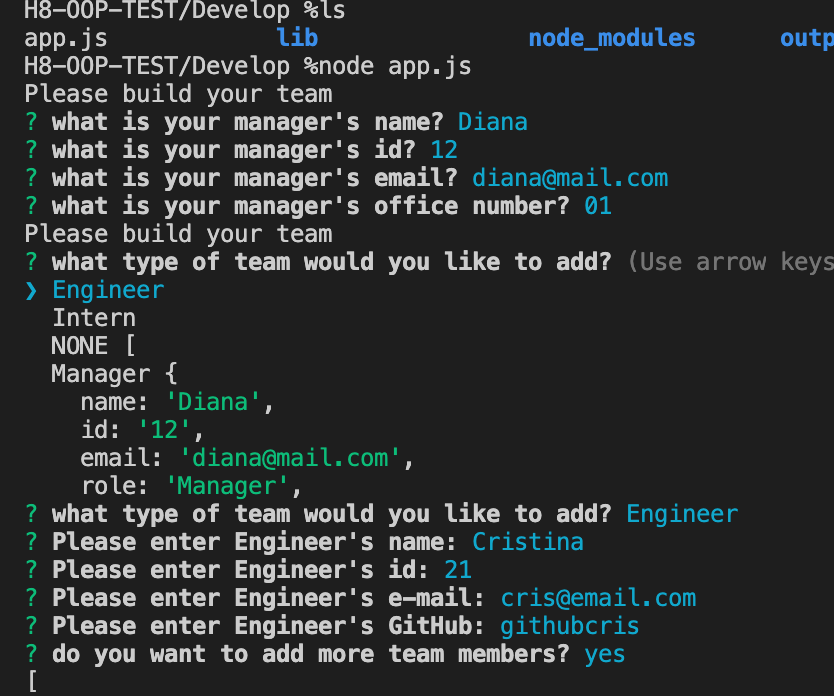
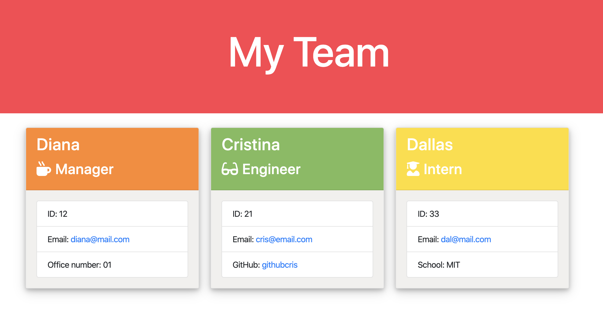

# H8-OOP-BUILD-TEAM

This application will allow you to build a team using using the command line.  You'll be able to input any number of team members choosing between engineers and interns.

## GettingStarted

Project Location

>[Project's GitHub repository](https://github.com/crisdc88/H8-OOP-TEST)

## Prerequisites

>N/A

## Built With

* Node js
* JEST
* CSS
* HTML


## Deployed Link

>N/A

## Installation

1. Clone project from github.
2. On terminal go to the projects path
3. run npm install
4. run node app.js
5. Answer question on console.
6. open team.html when generated

## Code-Snippets

```sh
Using inquirer library:

{
        type: "input",
        name: "engineeremail",
        message: "Please enter Engineer's e-mail:",
        when: (answer) => answer.engineerid, 
        validate: (input) => {
            const pass = input.match(/^\w+([\.-]?\w+)*@\w+([\.-]?\w+)*(\.\w{2,3})+$/);

            if (input === "" || !pass) {
               return "Please enter a valid e-mail";
            }
      
            return true;
         }
    },

// =========

looping through questions:

 if (answer.addmore === "yes" || answer.addmoreIntern === "yes") {
            init(questions2);
  }

// =========

OOP sample:


class Engineer extends Employee{

    constructor(name, id, email, github){
        super(name, id, email);
        this.github = github;
        super.role = "Engineer";
    }

    getGithub(){
        return this.github;
    }

}
```
## Screen shots

1. Console Input


2. HTML generated




## Author


D. Cristina Terry

GitHub: [https://github.com/crisdc88/](https://github.com/crisdc88/),

LinkedIn: [www.linkedin.com/in/dcristinaterry](www.linkedin.com/in/dcristinaterry)

## License


